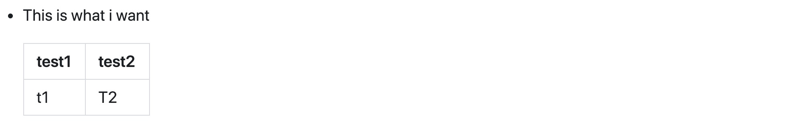
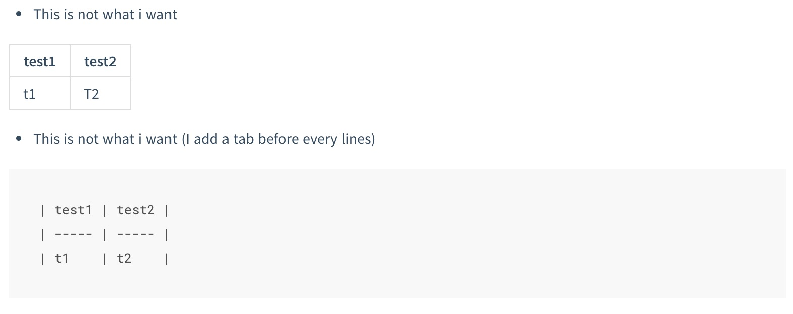

### TEST
* This is what i want

	| test1 | test2 |
	| ----- | ----- |
	| t1    | T2    |

* This is not what i want


| test1 | test2 |
| ----- | ----- |
| t1    | T2    |

* This is not what i want (I add a tab before every lines)


	| test1 | test2 |
	| ----- | ----- |
	| t1    | t2    |


### Source

```markdown
### TEST
* This is what i want

	| test1 | test2 |
	| ----- | ----- |
	| t1    | T2    |

* This is not what i want


| test1 | test2 |
| ----- | ----- |
| t1    | T2    |

* This is not what i want (I add a tab before every lines)


	| test1 | test2 |
	| ----- | ----- |
	| t1    | t2    |


```


### Preview

* preview picture in **github** (note: the table align at the left of the head)
	
* preview picture in **docsify**
	